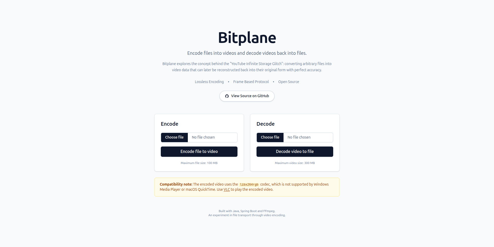

# Bitplane

**Visual Binary Storage System** — encode any file into a lossless grayscale video, and decode it back perfectly.

Inspired by the "YouTube Infinite Storage Glitch", Bitplane deterministically maps raw file bytes onto 1920×1080 grayscale video frames (one byte per pixel) and reconstructs the original file from those frames with zero data loss.

**Deployed at:** https://bitplane.duckdns.org/



## How It Works

### Encoding (File → Video)

1. The uploaded file is saved to an isolated UUID job workspace.
2. A **metadata frame** (frame 0) is written containing the original filename, file size, and total payload frame count, serialized as JSON with a 4-byte length prefix.
3. The file is split into chunks of up to **2,073,596 bytes** (`1920 × 1080 − 4`), each wrapped as a **payload frame** with a 4-byte frame index prefix.
4. Each frame is rendered as a 1920×1080 grayscale `BufferedImage` (one byte per pixel) and written to disk as a PNG.
5. **FFmpeg** assembles all PNGs into a lossless `output.mp4` using `libx264rgb` with `-crf 0 -preset veryslow`.
6. The video is streamed back to the browser and the workspace is deleted.

> **Compatibility note:** The `libx264rgb` codec is not supported by Windows Media Player or macOS QuickTime. Use [VLC](https://www.videolan.org/vlc/) to play the encoded video.

### Decoding (Video → File)

1. The uploaded `.mp4` is saved to an isolated workspace.
2. **FFmpeg** extracts all frames as PNGs into an `extracted_frames/` directory.
3. All frames are loaded into memory as `BufferedImage` objects and wrapped in an `ImageFrameSet`.
4. The metadata frame is decoded to recover the original filename, file size, and expected frame count.
5. Payload frames are deserialized, sorted by frame index, validated, and concatenated into a single byte array truncated to the exact original file size.
6. The reconstructed file is written to the workspace, then streamed back to the browser with its original filename, and the workspace is deleted.

### Frame Binary Layout

| Frame | Wire Format |
|---|---|
| Metadata | `[4 bytes: JSON length][N bytes: UTF-8 JSON]` |
| Payload | `[4 bytes: frame index (int)][remaining: payload bytes]` |

### Frame Capacity Example

For a 5 MiB file:
- Frame capacity: `1920 × 1080 = 2,073,600` bytes
- Payload per frame: `2,073,600 − 4 = 2,073,596` bytes
- Payload frames needed: `ceil(5,242,880 / 2,073,596) = 3`

## Tech Stack

| Layer | Technology |
|---|---|
| Language | Java 21 |
| Backend framework | Spring Boot (WebMVC + Thymeleaf) |
| Video processing | FFmpeg (`libx264rgb`, `-crf 0`) |
| Image processing | Java AWT / `BufferedImage` / `ImageIO` |
| Frontend | Thymeleaf templates + Tailwind CSS v4 (CDN) |
| Build | Maven (`mvnw` wrapper) |
| Code formatting | Spotless + Palantir Java Format |
| Containerization | Docker (multi-stage) + Docker Compose |
| CI | GitHub Actions |
| Execution tracking | `io.github.sathwikhbhat:api-execution-tracker` |

## Workspace & Cleanup

Each request gets an isolated UUID job directory under `data/temp/`. Cleanup is two-layered:

- **Immediate**: The controller streams the response and deletes the workspace in a `finally` block.
- **Scheduled fallback**: `WorkspaceCleanupService` runs every **5 minutes** and removes any workspace older than **10 minutes** as a safety net for crashes or OOM kills.

## Running Locally

### Prerequisites

- Java 21
- FFmpeg on `$PATH`
- Maven (or use the included `mvnw` wrapper)

### Build & Run

```bash
./mvnw spring-boot:run
```

The app starts on `http://localhost:8080`.

### Run with Docker

```bash
docker compose up --build
```

FFmpeg is installed automatically inside the Docker image. The app is available at `http://localhost:8080`.

## Development

### Format code

```bash
./mvnw spotless:apply
```

### Build & verify (includes format check)

```bash
./mvnw clean verify
```

### Format HTML/templates

```bash
npx prettier --write "src/**/*.html"
```

## CI

GitHub Actions runs on every push to `main` and on all pull requests:

1. Checkout code
2. Set up JDK 21 Temurin with Maven cache
3. `mvn clean verify`: builds, checks Spotless formatting, and runs tests

Improperly formatted Java will fail the CI build.

## Architecture

See [`ARCHITECTURE.md`](ARCHITECTURE.md) for a detailed breakdown of the encode pipeline, decode pipeline, video layer, and workspace lifecycle.
